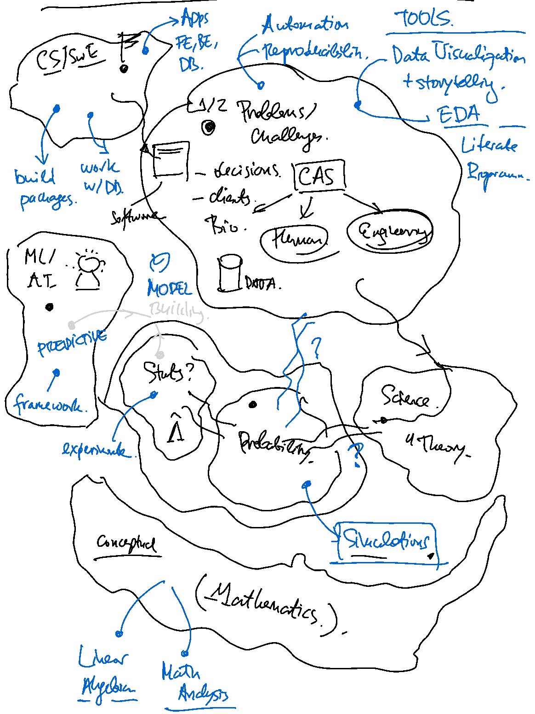

# Decision-making under uncertainty

This repository emerges out of teaching data science to students of various backgrounds and my practice in the industry. I aspire to contribute to the understanding of this complex landscape and teach people how to navigate it, how to develop valuable skills, and become more effective at problem-solving.

That's it, whatever will be published here can't be the be-all-end-all bootcamp or course. But here are a few of my beliefs, which may persuade you to take the long road to your own development in AI instead of searching for "the tutorial":

- There is no shortcut to a deep understanding of a domain, especially an interconnected network of fields and communities being in an evolving dialogue
- There is no shortcut to being skillful at something
- The journey from novice to expert is not linear, however, the "interest compounds"
- The journey need not be painful, but it can be seriously playful,a source of wonder and meaning
- Without skin in the game, we can't claim we truly get something
- Without a vision which is flexible enough, but at the same time long-lived:
    - In the case of rigidity - there is a risk of being stuck, rigid, or pursue obsessively, counterproductively, and getting fooled
    - In the case of everything goes - there is a risk of wandering aimlessly and not finding a home
- Fixating on beliefs and propositional knowing (the facts!) is counterproductive. Which should put into question all written above
- Fixating on skills makes you lose the grasp of the big picture

## Lecture previews: Practice and Readings

The repository will go through many changes as we go through the journey together, but you can get a sneak-peek of what it's about in the `/playground` directory. Of course it's unstable.

As outlined in the [course website](https://course.economic-cybernetics.com/), we'll be contemplating in the library and engineering in the trenches, so here are lecture thumbnails, along with the suggested practices and readings, updated every week.

## Lecture 1: Data Science in Business Context

The first lecture is conceptual, as we explore and articulate the big picture of AI. I highly suggest you read [this story](#the-philosophy-v2), which gives a fun outline and roadmap for the course.
- What is the course about and why should you care? I sketch it out [here](https://course.economic-cybernetics.com/).
- It is important to understand AI in context: what it is, where it is applied. Read [here](https://course.economic-cybernetics.com/01_fundamentals/background.html) to get the difference between Analytics, Statistics, and ML.
- See one of my conference talks at BigDataWeek, intended for a mixed tech/business audience: [Pragmatic AI in Google Cloud Platform](https://www.youtube.com/watch?v=02NPR_nDaxQ)
- M. Jordan explains what is AI, [how its meaning changed](https://hdsr.mitpress.mit.edu/pub/wot7mkc1/release/9) and what we're [far from a GAI](https://spectrum.ieee.org/stop-calling-everything-ai-machinelearning-pioneer-says) 


## Lecture 2: The probabilitstic Multiverse

The second lecture is also conceptual, but in a more mathematical sense, as I attempt to build the bridge between reality and the language of uncertainty (probability theory).

- Read about a few fundamental ideas and concepts in probability and why we need them [here](https://course.economic-cybernetics.com/01_fundamentals/stat_foundations.html)
- To assess if you need a refresher over probability and statistics, look at this study guide I wrote for the winter 2022 cohort [here](https://course.economic-cybernetics.com/05_archive/winter_2022.html)

There are three amazing resources which you can use as reference and inspiration for introductory to intermediate probability and mathematical statistics. They have recorded video lectures, a freely-available book, and the first two, code:
- [Probability 110](https://projects.iq.harvard.edu/stat110/home) by Joe Blitzstein (Harvard), with R code. Great stories behind probabilities, numerous examples of applications, and accessible proofs.
- [Probability for Data Science](https://probability4datascience.com/) by Stanley Chan (Purdue), with python code. Amazing graphics, visualizations, accessible and extensive mathematical treatment.
- [Probability](https://youtube.com/playlist?list=PLhCDzMM3Yov0ZIaxcUlsHh2T9XmiVqgMi) by Santosh Venkatesh (University of Pennsylvania), once available on coursera, now on youtube. Great real-world examples from numerous domains, gentle build-up towards more complicated concepts. Unfortunately, no code or book -- but you can combine this playlist with one of the above.

## Lecture 3: Simulation and Refactoring

- DAGs
- Python environments, modules, packages, jupyter notebook
- Functional programming

| | |
|:--:|:--:|
| **(Fig.1) - How many people will show up to safari?** [notebook here](https://github.com/Bizovi/decision-making/blob/main/playground/01_tourism.ipynb)| **(Fig.2) - We discussed the importance of visual storytelling:** relevance, persuasiveness,truthfulness, and aesthetics.


First, you have to be confident and comfortable with your local development tooling. Invest an hour to understand conda and type in the commands -- benefit a decade ahead!

- Walk through this tutorial: ["Introduction to conda for (data) scientists"](https://carpentries-incubator.github.io/introduction-to-conda-for-data-scientists/). It will serve you well for exploration and experimentation. 
    - For projects more focused on building data-driven applications, we will use `pip` and `poetry`.
    - We can use `conda` just for virtual environments and not for package management and dependency resolution / tracking.
    - Therefore, one has to pick an optimal approach for each project. Not great, but could be worse (as in `npm`)
- Read this old, but still relevant blog post about ["Conda: Myths and Misconceptions"](https://jakevdp.github.io/blog/2016/08/25/conda-myths-and-misconceptions/)


## Lecture 4: Bayes Theorem, LLN, CLT (upcoming...)

- parameter (estimand), estimator, estimation
- deMoivre: "The most dangerous equation"
- what does a statistician want? properties of estimators
- pymc
- exponential / poisson
- beta / binomial -> cheating and bayesian A/B testing
- linear regression
    - categorical variables
- bias-variance, rao-cramer, fisher information

| | |
|:--:|:--:|
| **(Fig.3) - Bayes Theorem and Rare Diseases. Inverse probabilities and conditioning** [notebook here](https://github.com/Bizovi/decision-making/blob/main/playground/02_bayes.ipynb)| **(Fig.4) - The greatest theorem never told** adapted and refactored [from CamDavidson](https://nbviewer.org/github/CamDavidsonPilon/Probabilistic-Programming-and-Bayesian-Methods-for-Hackers/blob/master/Chapter4_TheGreatestTheoremNeverTold/Ch4_LawOfLargeNumbers_PyMC3.ipynb) (upcoming!)


## Lecture 5: Generalized Linear Madness (upcoming ...)

- poisson regression and overdispersion -> generalized poisson
- negative binomial
- logistic regression
- multinomial regression (dirichlet)
- hierarchical models

## Lecture 6: A/B Testing and Causal Inference (upcoming ...)

- scientific process, 12 steps for statistics
- metrics
- hypothesis testing
    - power, confidence intervals, relevance

| | 
|:--:|
|  **(Fig.5) - The basic structures of causal reasoning** as a tool to become aware of fallacies and declare our modeling assumtions explicitly|

## Lecture 7: Tree-based ensembles (upcoming...)

- CRISP-DM, 12 steps for ML
- what is machine learning
    - implicit learning, intuition and bias
- bagging and boosting

## Lecture 8: Unsupervised Learning (upcoming...)


## Lecture 9: Deep Learning for Natural Language (upcoming...)

## Lecture 10: Deep Learning for Computer Vision (upcoming...)

## Lecture 11: Special topics - time series (upcoming...)

## Lecture 12: Special topics - recommender systems (upcoming...)


## Getting Started

If you have `conda` installed on Linux, MacOS or WSL2 on Windows, the easiest way to play around with the notebook is to recreate the environment from the yml file. Then, you can either create a kernel or connect from VSCode notebooks to the environment and start hacking.

```bash
git clone https://github.com/bizovi/decision-making.git

cd playground
conda env create --file conda-env.yml
conda activate gpa-prob

# if using a jupyter lab
python -m ipykernel install --user \
    --name="gpa-kernel" \
    --display-name="Kernel for Simulations"

# run the test suite and see if everything works as expected
python -m pytest 
```

## The philosophy v2

This is my second attempt at formulating a philosophy and principles for a challenging endeavor like this one. A moment of inspiration hit me and the following map resulted -- which strikes a resemblence with an idea of R. Sapolsky in one of his [lectures](https://youtu.be/NNnIGh9g6fA). 



For the lack of better graphics, here's a hand-drawn placeholder of the journey we embarked on.

> Here's the [point](https://alexvermeer.com/human-behavioral-biology-01-introduction/):
> - Sapolsky starts out with: our brains think about stuff by creating boundaries – i.e. ‘buckets’ – around ideas.
> - These buckets can influence our memory, our language, and our ability to see the ‘big picture’.
> - An implication of our bucketing minds is that we are bad at differentiating facts that fall within the same category. Two shades of red are labelled ‘red’.
> - A second larger implication is that when we focus on categories while talking about behavior, we lose out on the big picture.
> - It’s easy to see a single one of these categories as providing The Explanation. But they are merely various Behavior Buckets. They are all a part of the big picture explanation.
> - It is an easy trap to fall into. Flawed bucket thinking has been done by many of the most influential scientists in history!


A major goal is to not fall for bucket thinking – we must resist the temptation to find "The Explanation" in one bucket. Much time will be spent traversing the various buckets and when we stop for a while, we practice and try to understand. Repeat until we've came full circle with a renowed appreciation, perspective, and ability. Sapolsky taks about evolution, neuroscience, molecular genetics, ethology, etc. We're going trough different ones:

- Problem space (challenge land): understanding a domain where "we" have to make decisions, improve the relevant things for clients and stakeholders. There is much uncertainty there, questions about what will happen and how should we act. It's the real world, seen as a Complex Adaptive System.
    - Be it in firms, economics, and finance
    - Be it in biology and life sciences
    - Be it in engineering systems
    - This is where we get our data from and who we build software for!
- Science, especially cognitive science, which will give us insights about our intelligence, rationality, wisdom, foolishness, and biases. This is the place where we'll get the process/method, learn how to observe, formulate scientific hypotheses, use theories, theoretical models to make predictions and perform experiments. 
- In probability, we reason about uncertainty in the real world, build narratives and tell stories with DAGs of random variables, which are prague golemns, little robots which generate data. In the happy case they match the theoretical models and result in plausible patterns. We'll spend much time simulating phenomena, being the masters of these alternative multiverses. Not bad, aye?
- In statistics, we change our minds and actions in the face of evidence. We learn the skills of exploratory data analysis, experiment design, and causal inference. Why build models? To make better decisions, of course.
- Machine Learning and Deep Learning, the younger tribes of statistics are the future: they learn from data and when things go well, make reliable and robust predictions, in order to optimize the heck out of any process. Think of them as shamans or oracles, who sometimes overfit, therefore are prone to acting foolishly.
- We come back to the homeland of many of you: computer science and software engineering, the place where nowadays everything on this map becomes reality. We will learn how to build full-stack, data-driven software, good practices of the guild. While spending time here, an appreciation for the contribution of CS to all other places we already visited will become obvious.
- It is all overseen by philosophy. Some things don't change.
- Ah! We forgot about mathematics. It is everywhere, but also stands proud on its own. An essential prerequisite for everything we do, however, it is hard to do rigorous mathematics in the setup we outlined, as it will take a decade. The good news is -- we will be fine just with the starter pack!
