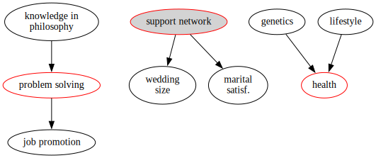

# Decision-making under uncertainty

This repository emerges out of teaching data science to students of various backgrounds and my practice in the industry. I aspire to contribute to the understanding of this complex landscape and teach people how to navigate it, how to develop valuable skills, and become more effective at problem-solving.

As outlined in the [course website](https://course.economic-cybernetics.com/), we'll be contemplating in the library and engineering in the trenches, so here are lecture thumbnails, along with suggested practices and readings. I recommend to start your journey with the statistical fundamentals, as I re-contextualize and build on top of them towards more sophisticated, but interpretable models, which would aid decision-makers. To learn more about the interdisciplinary approach to decision-making, read the [course philosophy](https://course.economic-cybernetics.com/#on-interdisciplinarity).

- [Module I: The fundamentals of Data Science](#module-i-the-fundamentals-of-data-science)
- [Module II: ML and Deep Learning](#module-ii-ml-and-deep-learning)
- [Module III: Full-Stack Data Apps in Python](#module-iii-full-stack-data-apps-in-python)
- [Getting started with the code examples](#getting-started)
- [Prerequisites (tbd)](#module-0-prerequisites)

The repository will go through many changes as we go through the journey together, but you can get a sneak-peek of what it's about in the `/playground` directory.


# Module I: The fundamentals of Data Science
## Lecture 1: Data Science in Business Context

The first lecture is conceptual, as we explore and articulate the big picture of AI. I highly suggest you read [this story](#the-philosophy-v2), which gives a fun outline and roadmap for the course.
- What is the course about and why should you care? I sketch it out [here](https://course.economic-cybernetics.com/).
- It is important to understand AI in context: what it is, where it is applied. Read [here](https://course.economic-cybernetics.com/01_fundamentals/background.html) to get the difference between Analytics, Statistics, and ML.


| | |
|:--:|:--:|
| **(Fig.1) - Learn what does Pollock and Picasso have to do with statistics and ML** | **(Fig.2) - Learn how everything you learned before fits together into a coherent whole**


## Lecture 2: The Probabilitstic Multiverse

The second lecture is also conceptual, but in a more mathematical sense, as I attempt to build the bridge between reality and the language of uncertainty (probability theory).


| | |
|:--:|:--:|
| **(Fig.3) - How many people will show up to safari?** [notebook here](https://github.com/Bizovi/decision-making/blob/main/playground/01_tourism.ipynb)| **(Fig.4) - We discussed the importance of visual storytelling:** relevance, persuasiveness,truthfulness, and aesthetics.


### Reading and Practice
<!-- Separate the reading and homework practice-->
- Read about a few fundamental ideas and concepts in probability and why we need them [here](https://course.economic-cybernetics.com/01_fundamentals/stat_foundations.html)
- To assess if you need a refresher over probability and statistics, look at [this study guide](https://course.economic-cybernetics.com/05_archive/winter_2022.html)

There are three amazing resources which you can use as reference and inspiration for introductory to intermediate probability and mathematical statistics. They have recorded video lectures, a freely-available book, and the first two, code:
- [Probability 110](https://projects.iq.harvard.edu/stat110/home) by Joe Blitzstein (Harvard), with R code. Great stories behind probabilities, numerous examples of applications, and accessible proofs.
- [Probability for Data Science](https://probability4datascience.com/) by Stanley Chan (Purdue), with python code. Amazing graphics, visualizations, accessible and extensive mathematical treatment.
- [Probability](https://youtube.com/playlist?list=PLhCDzMM3Yov0ZIaxcUlsHh2T9XmiVqgMi) by Santosh Venkatesh (University of Pennsylvania), once available on coursera, now on youtube. Great real-world examples from numerous domains, gentle build-up towards more complicated concepts. Unfortunately, no code or book -- but you can combine this playlist with one of the above.

## Lecture 3: Think like a Bayesian

Statistics is the art and science of changing your mind and action in the face of evidence. We're going to declare our assumptions and apply Bayes theorem to weight the information from data with our prior beliefs.

We're still in the land of probability and generative models, but a step closer towards making inferences about parameters and latent quantities, in order to answer the research questions.

| |  |
|:--:|:--:|
| **(Fig.5) - Bayes Theorem and Rare Diseases. Inverse probabilities and conditioning** [notebook here](https://github.com/Bizovi/decision-making/blob/main/playground/02_bayes.ipynb)| **(Fig. 6) - How confident am I code has no bugs after x tests pass?** Grids and point estimates|


## Lecture 4: Full Luxury Bayes and Large N

It's time we move away from point estimates, towards a full posterior distribution, which captures the uncertainty in our estimates and can be used to make prediction about the observable quantities.

A few important ideas to add to your conceptual understanding:
- Parameter (estimand), estimator, estimation
- DeMoivre: "The most dangerous equation": are U.S. schools too big?
- What does a statistician want? Properties of estimators.
- Most practical applications won't have an analytic solution, so we have to use a probabilistic programming language like pymc to draw samples from the posterior


|| | 
|:--:|:--:|
|**(Fig.7) - The greatest theorem never told** adapted and refactored [from CamDavidson](https://nbviewer.org/github/CamDavidsonPilon/Probabilistic-Programming-and-Bayesian-Methods-for-Hackers/blob/master/Chapter4_TheGreatestTheoremNeverTold/Ch4_LawOfLargeNumbers_PyMC3.ipynb) (upcoming!)|**(Fig.8) - Conjugate priors and the idea of Bayesian updating**. Full luxury bayes: automatic sampling, thoughtful modeling


## Lecture 5: Generalized Linear Madness (upcoming ...)

## Lecture 6: A/B Testing and Causal Inference (upcoming ...)


| | 
|:--:|
|**(Fig.9) - The basic structures of causal reasoning** as a tool to become aware of fallacies and declare our modeling assumtions explicitly|


# Module II: ML and Deep Learning

## Lecture 1: Tree-based ensembles (upcoming...)

## Lecture 1a: Fundamentals of classification (upcoming...)


## Lecture 2: Unsupervised Learning (upcoming...)

## Lecture 3: Deep Learning for Natural Language (upcoming...)

## Lecture 4: Deep Learning for Computer Vision (upcoming...)

## Lecture 5: Special topics - time series (upcoming...)

## Lecture 6: Special topics - recommender systems (upcoming...)

# Module III: Full-Stack Data Apps in Python


## Getting Started

If you have `conda` installed on Linux, MacOS or WSL2 on Windows, the easiest way to play around with the notebook is to recreate the environment from the yml file. Then, you can either create a kernel or connect from VSCode notebooks to the environment and start hacking.

```bash
git clone https://github.com/bizovi/decision-making.git

cd playground
conda env create --file conda-env.yml
conda activate gpa-prob

# if using a jupyter lab
python -m ipykernel install --user \
    --name="gpa-kernel" \
    --display-name="Kernel for Simulations"

# run the test suite and see if everything works as expected
python -m pytest 
```

## Lecture 1: The python ecosystem

| | 
|:--:|
|**(Fig.10) - Practicing the tools for modeling and operationalization of models**|

| | 
|:--:|
|**(Fig.11) - Getting comfortable with the idea of literate programming and learn the tools which make this whole zoo of technologies run harmoniously**|

## Lecture 2: Setting up an environment

- Python environments (conda), modules, packages, jupyter notebook
- Functional programming ideas in the context of numpy, pandas
- The great and terrible matplotlib

### Reading and Practice

First, you have to be confident and comfortable with your local development tooling. Invest an hour to understand conda and type in the commands -- benefit a decade ahead!

- Walk through this tutorial: ["Introduction to conda for (data) scientists"](https://carpentries-incubator.github.io/introduction-to-conda-for-data-scientists/). It will serve you well for exploration and experimentation. 
    - For projects more focused on building data-driven applications, we will use `pip` and `poetry`.
    - We can use `conda` just for virtual environments and not for package management and dependency resolution / tracking.
    - Therefore, one has to pick an optimal approach for each project. Not great, but could be worse (as in `npm`)
- Read this old, but still relevant blog post about ["Conda: Myths and Misconceptions"](https://jakevdp.github.io/blog/2016/08/25/conda-myths-and-misconceptions/)
- Read these two introductory articles on modules and packages
    - [Absolute vs Relative imports](https://realpython.com/absolute-vs-relative-python-imports/) by Mbithe Nzomo
    - [Python Modules and Packages – An Introduction](https://realpython.com/python-modules-packages/) by John Sturtz
- IMPORTANT! For those of you working on Windows 10/11, here's the best set-up I know of, which involves WSL2. [Here are the instructions](https://towardsdatascience.com/how-to-create-perfect-machine-learning-development-environment-with-wsl2-on-windows-10-11-2c80f8ea1f31)


# Module 0: Prerequisites